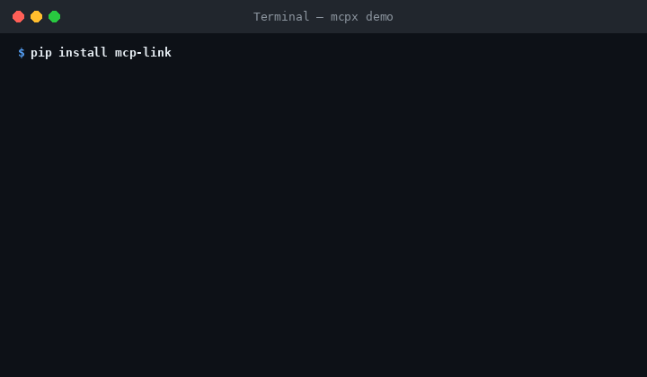

# mcpx — The MCP Server Package Manager



Install MCP servers in one command. No more manual JSON editing.


## Installation
> **Note:** The CLI command is `mcpx`. The PyPI package name is `mcp-link`
> (since `mcpx` was already taken on PyPI).

```bash

```


## Usage


```bash
mcpx install brave-search
mcpx install github -e GITHUB_PERSONAL_ACCESS_TOKEN=ghp_xxx
mcpx install filesystem --path ~/projects
mcpx list
mcpx search database
mcpx remove brave-search
```


mcpx auto-detects your AI clients (Claude Desktop, Cursor, Windsurf) and updates their config files safely, with a backup before every change.


## Commands


| Command | Description |
|---|---|
| `mcpx install <server>` | Install a server |
| `mcpx remove <server>` | Remove a server |
